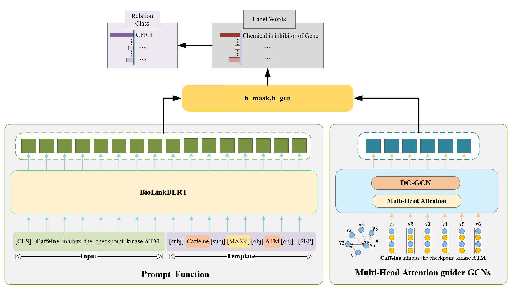

# GCNPL
### model
<p align="center">
  
</p>

## 1. Environments

```
- python (3.8.12)
- cuda (11.4)
```

## 2. Dependencies

```
numpy==1.18.0
scikit-learn==0.22.1
scipy==1.4.1
tqdm==4.41.1
transformers==4.0.0
- numpy (1.21.4)
- torch (1.10.0)
- gensim (4.1.2)
- transformers (4.13.0)
- pandas (1.3.4)
- scikit-learn (1.0.1)
- prettytable (2.4.0)
```

## 3. Dataset

Here we provide the processed GAD dataset

## 4. Preparation

- 
- 
## 5. Preparation
